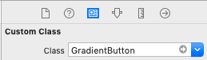

# Gradient Button
iOS Swift 5, class for Gradient Button

# Install
Add **GradientButton.swift** to your project.

# Customize
Make another class inherited from GradientButton and override public properties with colors. Or change it in GradientButton class.

# Initialization
Specify class for UIButton component in Identity Inspector, the button will apply style after that.

